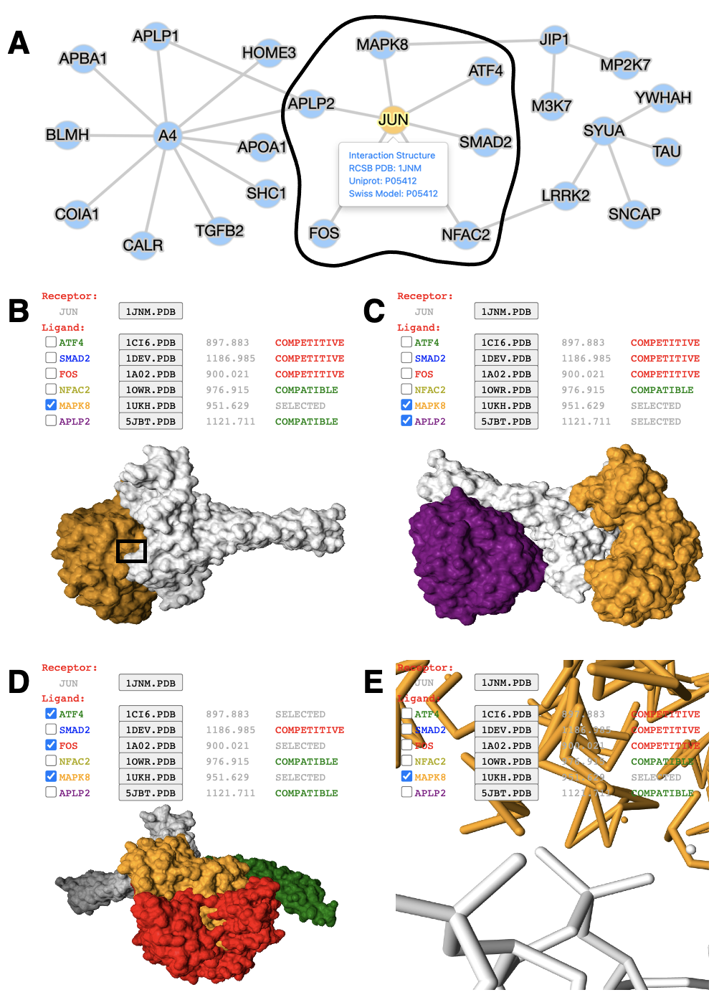

## mPPI: A Database Extension to Visualize Structural Interactome in One-to-many Manner

- **mPPI is widely applicable to diverse PPI databases**
- **mPPI distinguishs the complex structure of target protein and its multiple interactors**
- **mPPI facilitates multi-purpose drug design and protein complex structure prediction**

---
### Introduction

Protein–protein interaction (PPI) databases with structural information are useful to investigate biological functions at both systematic and atomic levels. However, most existing PPI databases only curate binary interactome. We developed mPPI, a database extension for multiway PPI structural visualization. mPPI can visualize target protein and its multiple interactors simultaneously, which facilitates multi-target drug discovery and structure prediction of protein macro-complexes. By employing a protein–protein docking algorithm, mPPI largely extends the coverage of structural interactome from experimentally resolved complexes. mPPI is customizable and convenient, which already has been used for several disease–related PPI databases.

---
### Graphical Abstract

The left part is the workflow of mPPI. After applying mPPI, the user’s database will acquire visualization functions demonstrated in the dashed box. In the dashed box, the left part is the 2D network representing binary protein–protein interaction from the user’s database. Any node in the network could be chosen to visualize its multiple interactors. The one-to-many structural presentation is highly flexible that the visibility, scale, angle and presentation style of each interactor can be adjusted for the most intuitive perspective. Two examples are demonstrated on the right side of the dashed box, where the colors correspond between the protein nodes and the 3D structures. Structurally compatible and competitive interactors are selected for visualization to assist protein macro-complex structure prediction and multi-target drug design. Atomic-level presentation is supported to further aid drug design and mechanism discovery, as shown in the middle of the dashed box.

---
### Installation

There are two modules in mPPI: [dock](https://github.com/yekaizhou/mppi/tree/main/dock) and [viz](https://github.com/yekaizhou/mppi/tree/main/viz). Each module contains two steps. By executing one command in dock module and importing results from dock module into viz module, users’ basic PPI databases will be extended with a structural visualization function.

- For proteins in user’s database, download structure files in PDB format; For pairwise interactions in user’s database, calculate their interaction conformation and docking scores from downloaded PDBs using ZDOCK.

- Segment docked protein complexes into two PDB files as two interactors. Store divided PDBs into folders in specific manner. The previous two steps are integrated into one script dock.sh.

- Using Cytoscape JavaScript library, scripts net.js and net.php are created to visualize node-and-edge PPI network.

- Employing NGLViewer, scripts mppi.js and mppi.php are designed to project the protein interaction structures in one-to-many manner.

Step-by-step installation instruction is at [implement](https://github.com/yekaizhou/mppi/blob/main/implement).

---
### Dependencies

- [ZDOCK](https://zlab.umassmed.edu/zdockconv3d/) = 3.0.2
- [Cytoscape.js](https://js.cytoscape.org/) = 3.19.1
- [NGL viewer](https://nglviewer.org/) = v2.0.0-dev.39

---
### Usage

Application of mPPI in a disease-related PPI database. (A) PPI network in node-and-edge representation. This example network is a sub-interactome containing 25 proteins related to [Neurodegeneration](http://bis.zju.edu.cn/ndatlas/). The black circle stressed out a sub-network center at protein JUN that will be structurally displayed in (B-E). (B-D) Presentation style and logistics of multiway structural interactions in mPPI. When selecting proteins to interact (in this example a protein MAPK8), the selected proteins will be tagged ‘SELECTED’, and all other proteins that are structurally compatible to them will be tagged ‘COMPATIBLE’, while other competitive ligands will be tagged ‘COMPETITIVE’, in the last column of each protein row. The checking and unchecking of each protein will change all the compatibility tags accordingly. (E) PPI conformation at atomic resolution. The partial image of structural interaction stressed out in black box in (B) intuitively displays the binding interface of JUN and MAPK8. For each protein ligands, the docked structures can be downloaded for users’ further analysis by clicking the ‘.PDB’ button behind each protein name, and the docking scores (representing the tightness of the interaction calculated by ZDOCK) are shown behind each ‘.PDB’ button.

---
### Applications

- A demo can be viewed at [mPPI](http://bis.zju.edu.cn/mppi/).
- mPPI has been employed in [NDAtlas](http://bis.zju.edu.cn/ndatlas/).

---
### Citation

Yekai Zhou, Hongjun Chen, Sida Li, Ming Chen, mPPI: a database extension to visualize structural interactome in a one-to-many manner, Database, Volume 2021, 2021, baab036, https://doi.org/10.1093/database/baab036

---
### Contact

For any problems or suggestions regarding _mPPI_, please post on [Github Issue](https://github.com/yekaizhou/mppi/issues) or send to yekai.zhou@outlook.com.
