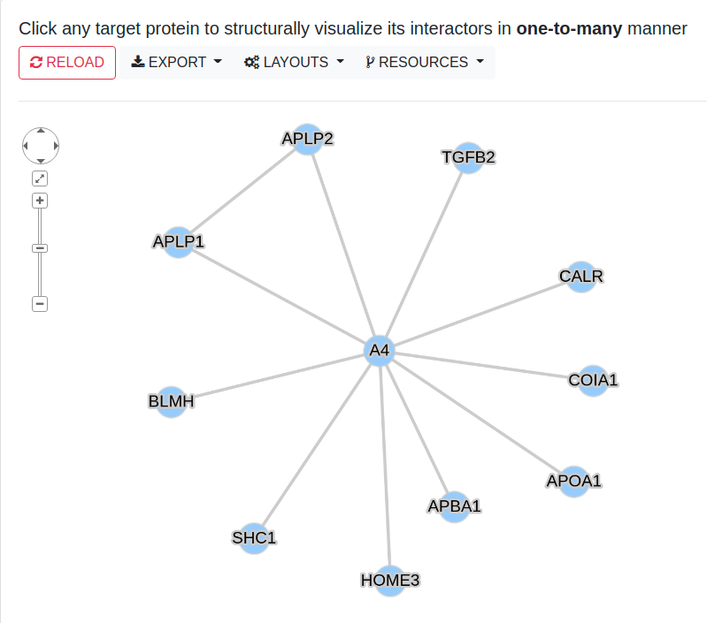
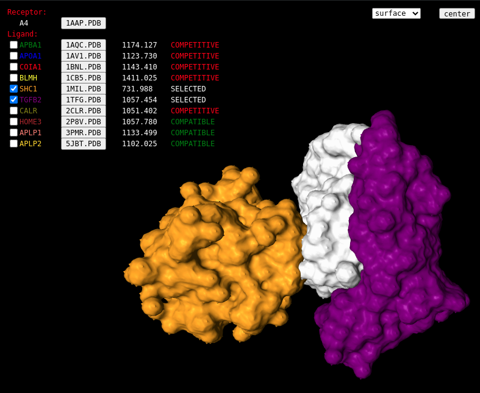

# Implement of mPPI


- In this tutorial, we will demonstrate how to implement mPPI to achieve an **Example Application** centered in protein A4, by using demo data in the download files.
- By replacing demo data with the data from user's PPI database, the database will be able to visualize one-to-many structural proteome.

    > Although NGLViewer and mPPI scripts could run in most modern systems, ZDOCK requires strictly **Linux, Unix or macOS** machines with different sets of scripts. Users should select corresponding version of ZDOCK scripts in the _dock_ module.

    > Considering the heavy calculation of in-batch protein docking and the potential dependency problems, a **Linux server with great computing capability** is recommended.


## Step ①-② in the _dock_ module

- Download **dock**. Download **example**, where the inner **pdb** folder, **interaction.txt**, and **proteins.txt** contain demo data to achieve Example Application, that need to be moved to the dock folder.

   > **_dock_ folder**
   >
   > `pdb, interaction.txt, proteins.txt` // user input
   >
   > `dock.sh` // integrated script
   >
   > `create.pl, createFolder.py` // scripts employed by `dock.sh`
   >
   > `marked2output+readscore.py` // script employed by `dock.sh`
   >
   > `output2dockres.py, mark.py` // scripts employed by `dock.sh`
   >
   > `rec2dockres.py, unirec.py` // scripts employed by `dock.sh`
   >
   > `create_sql.py` // scripts employed by `dock.sh`
   >
   > `uniCHARMM` // protein surface document in ZDOCK
   >
   > **`linux, mac` // ZDOCK modules in Linux and macOS system containing three scripts `creaet_lig, mark_sur, zdock`**
   
- Copy the three scripts in corresponding folder into the father folder `dock`
  
  > dock folder now contains: `pdb, interaction.txt, dock.sh, create.pl, createFolder.py, marked2output+readscore.py, output2dockres.py, mark.py, rec2dockres.py, unirec.py, create_sql.py, uniCHARMM` and three newly copied scripts **`creaet_lig, mark_sur, zdock`**
  
- To conduct _dock_ module for your PPI database, you should replace demo **pdb**, **interaction.txt**, and **proteins.txt** with your own data.
   > For proteins in your database with structural annotation, download PDB files from `www.rcsb.org` into pdb folder.
   
   > Gather protein interaction information in your database into **interaction.txt**.
   
   > Gather protein information in your database into **proteins.txt**
   
   > _**Follow the format in the demo files.**_

- Here we continue to demonstrate with the demo input.
  > **_pdb_ folder** 
  > 
  > `1aap.pdb 1aqc.pdb 1av1.pdb 1bnl.pdb 1cb5.pdb 1mil.pdb` 
  > 
  > `1tfg.pdb 2clr.pdb 2p8v.pdb 3pmr.pdb 5jbt.pdb`

    > **interaction.txt** 
    >
    > `1AAP 1AQC`
    >
    > `1AAP 1AV1`
    >
    > `1AAP 1BNL`
    >
    > `1AAP 1CB5`
    >
    > `1AAP 1MIL`
    >
    > `1AAP 1TFG`
    >
    > `1AAP 2CLR`
    >
    > `1AAP 2P8V`
    >
    > `1AAP 3PMR`
    >
    > `1AAP 5JBT`
    >
    > `3PMR 5JBT`
  
    > **proteins.txt** 
    >
    > `A4 1AAP P05067`
    >
    > `APBA1 1AQC Q02410`
    >
    > `APOA1 1AV1 P02647`
    >
    > `COIA1 1BNL P39060`
    >
    > `BLMH 1CB5 Q13867`
    >
    > `SHC1 1MIL P29353`
    >
    > `TGFB2 1TFG P61812`
    >
    > `CALR 2CLR P27797`
    >
    > `HOME3 2P8V Q9NSC5`
    >
    > `APLP1 3PMR P51693`
    >
    > `APLP2 5JBT Q06481`
  
- Execute `./dock.sh` in command line in current workspace.
  > **Some potential problems when executing this step:**

  > Users might need to change the access permissions of the downloaded `dock.sh`, e.g. `chmod 755 dock.sh`.

  > **ZDOCK** employed some libraries that users' systems currently might not equipped with, e.g. `libg2c`. At the first time of running `./dock.sh`, The system would prompt missing dependencies of user's environment. After installing the required libraries, `dock.sh` will be executed successfully. For example, Ubuntu users can install and download libg2c using the following command:
  >
  > `wget http://old-releases.ubuntu.com/ubuntu/pool/universe/g/gcc-3.4/libg2c0_3.4.6-8ubuntu2_amd64.deb`
  >
  > `sudo dpkg -i --force-all libg2c0_3.4.6-8ubuntu2_amd64.deb`
  
- `./dock.sh` will result in **dockRes** folder, **score.txt** and **ppi.sql**, which represent docked PDB files and SQL file with interactome information that will be used in _mppi_ module.
  
   > **output score.txt with demo input** 
   > `1aap 1aqc 1174.127`
   > `1aap 1av1 1123.731`
   > `1aap 1bnl 1143.410`
   > `1aap 1cb5 1411.026`
   > `1aap 1mil 731.988`
   > `1aap 1tfg 1057.454`
   > `1aap 2clr 1051.402`
   > `1aap 2p8v 1057.780`
   > `1aap 3pmr 1133.498`
   > `1aap 5jbt 1102.025`
> `3pmr 5jbt 1162.250`

   > **output dockRes folder with demo input** 
> `1aap 1aqc 1av1 1bnl 1cb5 1mil 1tfg 2clr 2p8v 3pmr 5jbt`

   > **1aap folder in dockRes** 
   > `1aap.pdb 1aqc.pdb 1av1.pdb 1bnl.pdb 1cb5.pdb 1mil.pdb` 
   > `1tfg.pdb 2clr.pdb 2p8v.pdb 3pmr.pdb 5jbt.pdb`


## Step ③-④ in the _viz_ module

- Download **viz**. Deploy resulting folder **mppi** into web server environment.
  
   > **_viz_ folder** 
   >
   > `dockRes` // demo input in **viz.zip**, replace by previously calculated one
   >
   > `ppi.sql` // demo input in **viz.zip**, imported with node and edge info from user's database and docking score from `score.txt`
   >
   > `DBConnect.php` // database connection script, input connection info
   >
   > `mppi.js mppi.php net.js net.php` // core scripts in **viz**
   >
   > `packages` // employed packages
   
- To conduct `viz` module for your PPI database, you should replace demo **dockRes** and **ppi.sql** with your own data.
   > If you processed demo data in the previous module, the calculated files and given demo files would be the same. Use either ones to continue achieving the example application.
   
- Here we continue to use demo **ppi.sql** and **dockRes** to realize example application.
```sql
-- ppi.sql 
CREATE TABLE `ppi_edge` (
  `p1id` int(5) DEFAULT NULL,
  `p2id` int(5) DEFAULT NULL,
  `docking_score` decimal(9,3) DEFAULT NULL
) ENGINE=InnoDB DEFAULT CHARSET=utf8;

CREATE TABLE `ppi_compatible` (
  `receptor` int(5) DEFAULT NULL,
  `p1id` int(5) DEFAULT NULL,
  `p2id` int(5) DEFAULT NULL
) ENGINE=InnoDB DEFAULT CHARSET=utf8;

CREATE TABLE `ppi_node` (
  `id` int(5) DEFAULT NULL,
  `label` varchar(11) DEFAULT NULL,
  `pdb` varchar(6) DEFAULT NULL,
  `uniprot` varchar(8) DEFAULT NULL
) ENGINE=InnoDB DEFAULT CHARSET=utf8;

INSERT INTO `ppi_node` (`id`, `label`, `pdb`, `uniprot`) VALUES
(1, 'A4', '1AAP', 'P05067'), (2, 'APBA1', '1AQC', 'Q02410'), (3, 'APOA1', '1AV1', 'P02647'), (4, 'COIA1', '1BNL', 'P39060'), (5, 'BLMH', '1CB5', 'Q13867'), (6, 'SHC1', '1MIL', 'P29353'), (7, 'TGFB2', '1TFG', 'P61812'), (8, 'CALR', '2CLR', 'P27797'), (9, 'HOME3', '2P8V', 'Q9NSC5'), (10, 'APLP1', '3PMR', 'P51693'), (11, 'APLP2', '5JBT', 'Q06481');

INSERT INTO `ppi_edge` (`p1id`, `p2id`, `docking_score`) VALUES
(1, 2, '1174.127'), (1, 3, '1123.730'), (1, 4, '1143.410'), (1, 5, '1411.025'), (1, 6, '731.988'), (1, 7, '1057.454'), (1, 8, '1051.402'), (1, 9, '1057.780'), (1, 10, '1133.499'), (1, 11, '1102.025'), (10, 11, '1162.250');

INSERT INTO `ppi_compatible` (`receptor`, `p1id`, `p2id`) VALUES
(1, 8, 7), (1, 7, 11), (1, 7, 9), (1, 7, 6), (1, 7, 4), (1, 7, 2), (1, 7, 10), (1, 11, 6), (1, 9, 6), (1, 6, 5), (1, 6, 10), (10, 11, 1);
```

- Import **ppi.sql** into `MySQL`, and link it to **DBConnect.php**.
```sql
  -- commands to import ppi.sql into MySQL
  mysql> create database ppi;
  mysql> use ppi;
  mysql> source ./ppi.sql
```
```php
  // code snippet in DBConnect.php
  $servername = ""; // fill in with your own database information
  $username = "";   // fill in with your own database information
  $password = "";   // fill in with your own database information
  $database = "ppi";
```
- Open **net.php** in web server environment, and it will result in a visualization platform that support one-to-many structural visualization.


## Result




